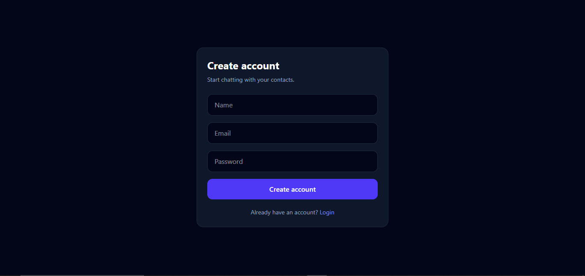
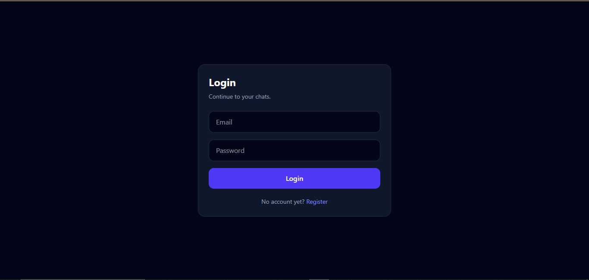
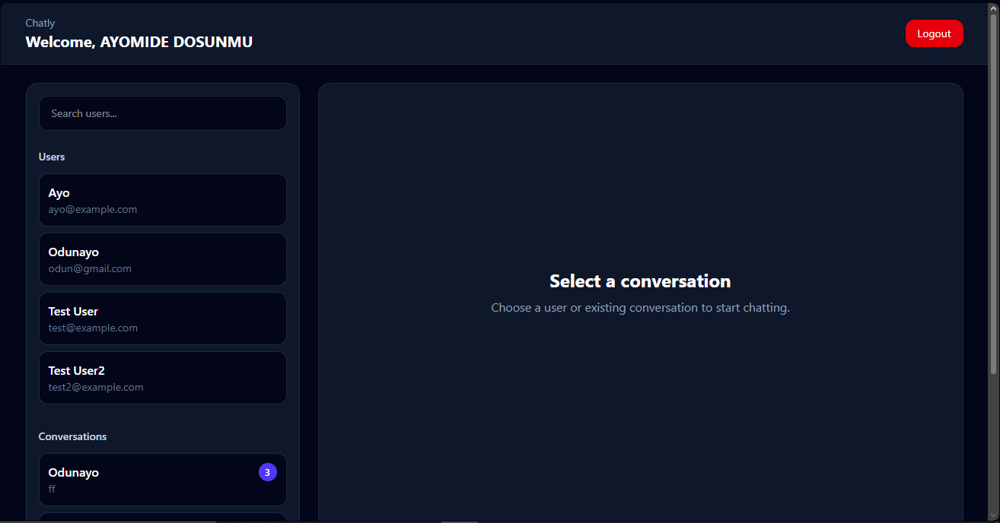
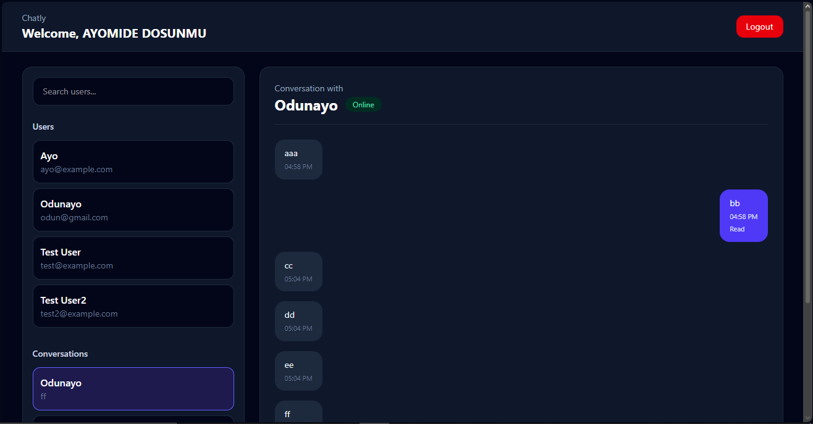
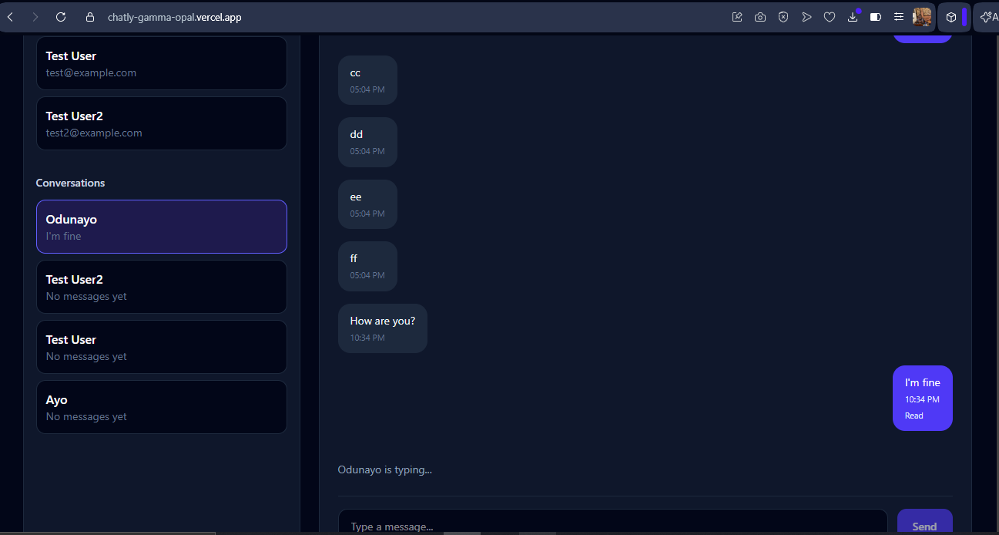

This project demonstrates my ability to design and build a real-time fullstack application with live data synchronization, socket-based communication, and production deployment.

# Chatly – Real-Time Full Stack Chat Application

Chatly is a full-stack real-time messaging application that allows users to register, log in securely, search for users, start conversations, send and receive messages instantly, and track message status with read receipts and unread counts.

The application uses JWT authentication, Socket.io for real-time communication, MongoDB for data storage, and was fully deployed using Render (backend) and Vercel (frontend).

---

## Live Demo

Frontend:  
https://chatly-gamma-opal.vercel.app/

Backend API:  
https://chatly-ntqh.onrender.com/

---

## Features

### Authentication
- User registration
- User login
- JWT authentication
- Protected backend routes
- Protected frontend routes
- Persistent login using localStorage token storage
- Logout functionality

### Real-Time Messaging
- One-to-one conversations
- Send and receive messages instantly using Socket.io
- Messages persist in MongoDB
- Automatic conversation creation

### Chat Features
- Typing indicator (live)
- Online/offline user status
- Read receipts (Sent / Read)
- Unread message counts
- Latest message preview in sidebar

### User Interaction
- Search users
- Start new conversation
- View existing conversations
- Select and switch conversations

### Performance & UX
- Optimized state updates (no full refetch on new messages)
- Smooth real-time updates
- Auto-scroll to latest message
- Loading states
- Error handling
- Empty states

---

## Tech Stack

### Frontend
- React
- React Router DOM
- Context API
- Axios
- Tailwind CSS
- Vite
- Socket.io Client

### Backend
- Node.js
- Express.js
- MongoDB
- Mongoose
- JWT Authentication
- bcryptjs
- Socket.io

### Deployment
- Vercel (Frontend)
- Render (Backend)
- MongoDB Atlas (Database)

---

## Screenshots

### Register

### Login

### Chat Dashboard

### Active Conversation

### Typing Indicator & Live Updates

---

## API Endpoints

### Auth Routes
POST /api/auth/register  
POST /api/auth/login  
GET /api/auth/me  

### User Routes
GET /api/users  

### Conversation Routes
POST /api/conversations  
GET /api/conversations  

### Message Routes
POST /api/messages  
GET /api/messages/:conversationId  
PATCH /api/messages/:conversationId/read  

---

## Local Setup Instructions

### Clone repository

git clone https://github.com/Doswin5/chatly.git  
cd chatly  

---

### Backend setup

cd backend  
npm install  

Create `.env` file:

PORT=5000  
MONGO_URI=your_mongodb_uri  
JWT_SECRET=your_secret_key  
CLIENT_URL=http://localhost:5173  

Run backend:

npm run dev  

---

### Frontend setup

cd frontend  
npm install  

Create `.env` file:

VITE_API_URL=http://localhost:5000  

Run frontend:

npm run dev  

---

## Production Challenges I Solved

### Real-Time Synchronization
Implemented Socket.io to handle live messaging, typing indicators, and online user tracking.

### Unread Message Optimization
Avoided full API refetch by updating conversation state directly for better performance and UX.

### CORS Issues
Configured backend to allow Vercel frontend origin and Socket.io connections.

### Environment Variables
Handled separate environment configs for development and production deployments.

### Socket Authentication
Secured socket connections using JWT verification before allowing access.

---

## Key Lessons Learned

- Designing real-time systems
- Managing global vs local state in React
- Handling WebSocket communication with Socket.io
- Optimizing UI updates without unnecessary API calls
- Structuring scalable backend APIs
- Deploying fullstack apps with real-time features

---

## Future Improvements

- Group chats
- Image and file sharing
- Message reactions (emoji)
- Push notifications
- Message editing and deletion
- Multi-device session handling

---

## Author

Built by Dosunmu Ayomide  

Fullstack Developer focused on building scalable and production-ready web applications.

GitHub: https://github.com/Doswin5